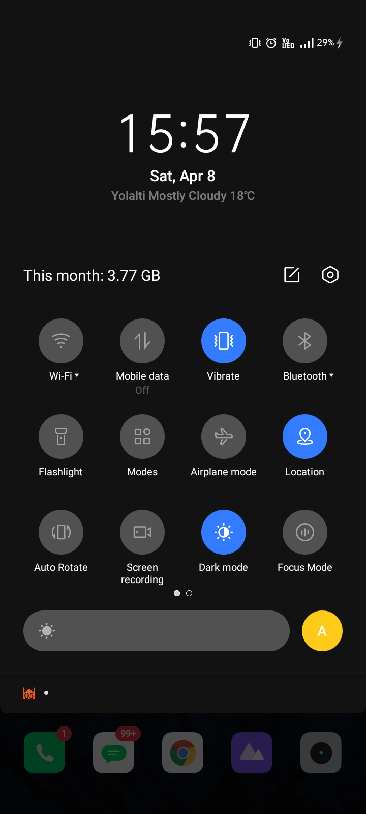
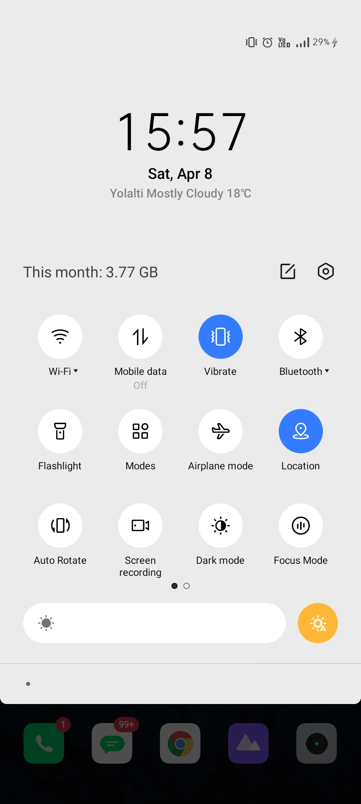

# Splash Screen

With this project we created splash screen with Flutter Package called Flutter Native Splash.

1- First add package in pubspec.yaml file.

<pre>
dependencies:
  flutter_native_splash: ^latest_version
</pre>

2- Then created splash screen on pubspec.yaml file.

<pre>
# flutter_native_splash-development.yaml
flutter_native_splash:
  color: "#ffffff"
  image: assets/flutter.png
  color_dark: "#121212"
  image_dark: assets/flutter.png

  android_12:
    image: assets/flutter.png
    icon_background_color: "#ffffff"
    image_dark: assets/flutter.png
    icon_background_color_dark: "#121212"

  web: false
</pre>

3- Run the package.

<pre>
flutter pub run flutter_native_splash:create
</pre>

P.s. If you customize again splash screen, you should flutter clean.

 

## Images

 

  
  
  
  

 

## Gif

 

  

